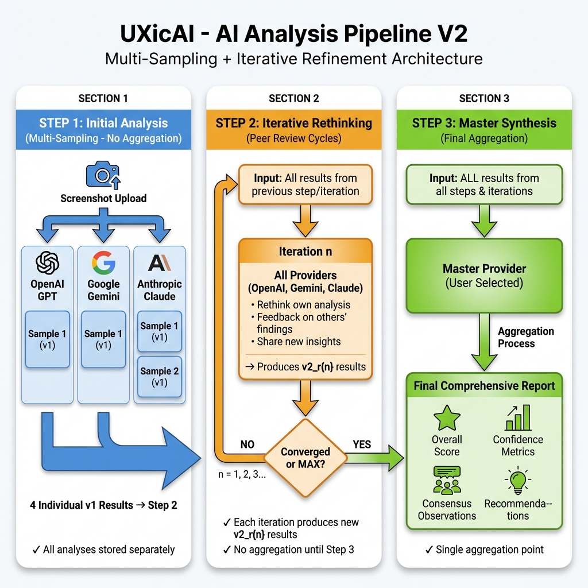

# AnalyzicAI

**AnalyzicAI** is the umbrella brand for a family of AI-powered analysis tools. This monorepo contains the brand website and specialized analysis applications.

## Landing Page

- **[analyzicai.com](https://analyzicai.com)** — Brand website and ecosystem hub

## Analysis Apps

- **[solidicai.com](https://solidicai.com)** — Smart contract analysis platform
- **[uxicai.com](https://uxicai.com)** — UI/UX design analysis platform

*All analysis apps leverage multi-agent iterative rethinking consensus (OpenAI GPT, Google Gemini, Anthropic Claude).*

> 💡 **Interested in analysis tools for legal cases, medical data, or other domains?** [Open a GitHub issue](https://github.com/web3web4/analyzicai/issues) to suggest it!

## Packages

- **ai-core** — Shared AI provider logic and pipeline
- **ai-ui-library** — Shared UI components
- **shared-platform** — Common platform utilities

## Quick Start

```bash
pnpm install
pnpm run dev
```

Auto-starts Supabase, applies migrations, and launches Next.js on [http://localhost:3001](http://localhost:3001).

## Tech Stack

- **Framework**: Next.js 16 (App Router) + TypeScript
- **Backend**: Supabase (Auth, PostgreSQL, Storage)
- **AI**: OpenAI GPT-4V, Google Gemini, Anthropic Claude
- **UI**: Tailwind CSS, WebRTC screen capture

## Documentation

- [Features](docs/FEATURES.md) — Implemented features & capabilities
- [Initial Implementation Plan](docs/INITIAL_IMPLEMENTATION_PLAN.md) — Architecture & progress
- [Supabase Setup](docs/SUPABASE_SETUP.md) — Database & migrations
- [Deployment Guide](docs/DEPLOYMENT.md) — Production deployment details
- [AI Pipeline V1](docs/AI_PIPELINE.md) — Two-step analysis
- [AI Pipeline V2](docs/v2-todo/AI_PIPELINE_V2.md) — Multi-step consensus (WIP)
- [Agent Docs](AGENTS.md) — AI agent development rules

### AI Pipeline V1 (Current)


### AI Pipeline V2 (In Progress)



## Status

**MVP 🚧**:

- ✅ User authentication with Supabase
- ✅ UXicAI rough version based on WebRTC screen capture and/or image upload in addition to providing a context about the app.
- ✅ SolidicAI rough version that analyze smart contract(s) provided in text or at a GitHub url.
- ✅ Multi-step AI analysis pipeline (v1: two steps processing: 3 parallel providers processing then synthesis)
- 🚧 Multi-step AI analysis pipeline (v2: three steps processing: introduce re-think as an intermediate iterative step)
- 🚧 Analysis history with filtering
- 🚧 Rate limiting & usage tracking
- 🚧 Prompts optimization
- 🚧 Responsive design polish
- ...

## License

Copyright © 2026 Web3Web4. All rights reserved — for licensing, collaboration, or permissions, please contact the author.
