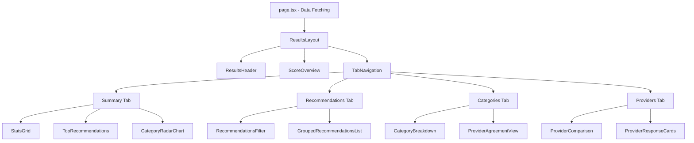

# Results Page Refactoring Plan

## Current Issues

The `[src/app/dashboard/results/[id]/page.tsx](src/app/dashboard/results/[id]/page.tsx)` file has several architectural problems:

1. **Monolithic structure**: 411 lines in a single file with all components, utilities, and data fetching
2. **Code redundancy**: Repeated styling patterns, similar logic across components
3. **Missing features**: `providerAgreement` field is fetched but never displayed
4. **Poor information hierarchy**: All provider responses hidden in a collapsible section with no prioritization
5. **Limited interactivity**: No filtering, sorting, or comparison views

## Refactoring Strategy

### Architecture Overview



### New File Structure

```
src/app/dashboard/results/[id]/
├── page.tsx                          # Data fetching & layout orchestration
├── components/
│   ├── layout/
│   │   ├── ResultsHeader.tsx         # Header with navigation
│   │   └── ResultsLayout.tsx         # Main layout wrapper
│   ├── overview/
│   │   ├── ScoreOverview.tsx         # Hero section with score circle
│   │   ├── ScoreCircle.tsx           # Circular score visualization
│   │   └── StatsGrid.tsx             # NEW: Key statistics cards
│   ├── recommendations/
│   │   ├── RecommendationsList.tsx   # Main recommendations component
│   │   ├── RecommendationCard.tsx    # Individual recommendation
│   │   ├── RecommendationsFilter.tsx # NEW: Filter controls
│   │   └── GroupedRecommendations.tsx# NEW: Grouped by category/severity
│   ├── categories/
│   │   ├── CategoryBreakdown.tsx     # Category scores with details
│   │   ├── CategoryCard.tsx          # Individual category card
│   │   ├── CategoryRadarChart.tsx    # NEW: Radar chart visualization
│   │   └── ProviderAgreementView.tsx # NEW: Agreement heatmap
│   ├── providers/
│   │   ├── ProviderComparison.tsx    # NEW: Side-by-side comparison
│   │   ├── ProviderResponseCard.tsx  # Individual provider response
│   │   └── ResponseStepSection.tsx   # Group responses by step
│   ├── tabs/
│   │   ├── SummaryTab.tsx            # NEW: Primary view tab
│   │   ├── RecommendationsTab.tsx    # NEW: Full recommendations tab
│   │   ├── CategoriesTab.tsx         # NEW: Detailed categories tab
│   │   └── ProvidersTab.tsx          # NEW: Provider responses tab
│   └── ui/
│       ├── Tabs.tsx                  # NEW: Tab component (or use Radix)
│       ├── Badge.tsx                 # Severity badge component
│       └── ProgressBar.tsx           # Reusable progress bar
├── lib/
│   ├── utils.ts                      # Utility functions (scoring, formatting)
│   ├── hooks.ts                      # Custom hooks (filtering, grouping)
│   └── constants.ts                  # Constants (category names, colors)
└── types.ts                          # Local type definitions
```

## Key Improvements

### 1. Component Extraction & Modularization

**Benefits**:

- Each component has single responsibility
- Easier to test individual components
- Better code reusability
- Improved maintainability

**Key Extractions**:

- Move inline components to separate files
- Extract utility functions to `lib/utils.ts`
- Create reusable UI primitives in `components/ui/`

### 2. Progressive Disclosure with Tabs

**Current**: Everything shown at once or hidden in `<details>`

**New Approach**: Four-tab layout for different user needs

#### Tab 1: Summary (Default View)

- Overall score with visual indicator
- Key statistics grid (critical issues, consensus, analysis time)
- Top 5 recommendations by severity
- Category radar chart showing all 8 categories
- Provider agreement heatmap

#### Tab 2: Recommendations

- Filterable/sortable full recommendations list
- Group by category or severity
- Search functionality
- Priority indicators (quick wins, critical, enhancements)

#### Tab 3: Categories

- Detailed breakdown of all 8 categories
- Expandable cards with observations
- Provider agreement per category
- Comparison between provider scores

#### Tab 4: Providers

- Individual provider responses (v1 & v2)
- Side-by-side comparison view
- Metadata (tokens, latency)
- Toggle between steps

### 3. Provider Agreement Visualization

**Currently Missing**: `providerAgreement` array exists but not displayed

**Implementation**:

```typescript
// Example data structure
providerAgreement: [
  { category: "colorContrast", agreement: "high" },
  { category: "typography", agreement: "medium" },
  { category: "accessibility", agreement: "low" },
];
```

**Visual Representation**:

- Heatmap showing agreement level per category
- Color-coded indicators (green=high, yellow=medium, red=low)
- Tooltip explaining what low agreement means
- Badge showing overall consensus score

### 4. Enhanced Data Visualization

**New Components**:

1. **CategoryRadarChart**: Spider/radar chart showing all 8 categories at once
2. **StatsGrid**: Dashboard-style statistics (critical issues count, avg score, consensus %)
3. **ProviderComparison**: Side-by-side score comparison across providers
4. **SeverityDistribution**: Visual breakdown of recommendations by severity

### 5. Utility Functions & Constants Extraction

**Current**: Utilities scattered throughout the file

**New Structure**:

```typescript
// lib/utils.ts
export const getScoreColorClass = (score: number, type?: "text" | "bg") => {...}
export const getSeverityStyles = (severity: string) => {...}
export const formatCategoryName = (key: string) => {...}
export const calculateConsensusScore = (agreement: ProviderAgreement[]) => {...}
export const groupRecommendations = (recs: Recommendation[], by: "category" | "severity") => {...}

// lib/constants.ts
export const CATEGORY_LABELS = {
  colorContrast: "Color Contrast",
  typography: "Typography",
  layoutComposition: "Layout & Composition",
  // ... etc
}

export const SEVERITY_ORDER = ["critical", "high", "medium", "low"]
```

### 6. Smart Filtering & Grouping

**New Features**:

- Filter recommendations by severity (multi-select)
- Filter by category (multi-select)
- Sort by severity, category, or agreement
- Search within recommendations
- Group recommendations by category or severity

**Implementation**: Custom React hook

```typescript
// lib/hooks.ts
export function useFilteredRecommendations(
  recommendations: Recommendation[],
  filters: { severities?: string[]; categories?: string[]; search?: string }
) {
  // Filtering logic with useMemo for performance
}
```

### 7. Performance Optimizations

**Strategies**:

1. **Lazy load provider responses**: Only render when tab is active
2. **Memoize calculations**: Use `useMemo` for grouping, filtering, agreement calculations
3. **Virtualize long lists**: If recommendations > 50, use virtual scrolling
4. **Code splitting**: Dynamic imports for chart library

### 8. Improved Empty/Loading States

**Enhancements**:

- Show progress steps (Step 1/3: Initial Analysis...)
- Display partial results while processing
- Better error state with retry action
- Skeleton loaders for each section

## Implementation Order

### Phase 1: Foundation (High Priority)

1. Create file structure and extract utilities
2. Build reusable UI components (Badge, ProgressBar, Tabs)
3. Extract existing components (ScoreCircle, CategoryCard, etc.)
4. Set up constants and type definitions

### Phase 2: Core Features (High Priority)

1. Implement tab navigation structure
2. Build SummaryTab with StatsGrid
3. Add provider agreement visualization
4. Create RecommendationsTab with filtering
5. Build CategoriesTab with detailed breakdowns

### Phase 3: Advanced Features (Medium Priority)

1. Add CategoryRadarChart visualization
2. Implement ProviderComparison component
3. Add search and advanced filtering
4. Implement grouping by category/severity

### Phase 4: Polish (Lower Priority)

1. Add export/share functionality
2. Improve loading states with real-time updates
3. Add historical comparison (if applicable)
4. Performance optimizations (memoization, lazy loading)

## Technical Decisions

### UI Component Library

- **Use Radix UI** for tabs/accordion (headless, accessible)
- **Use Recharts** for data visualization (lightweight, React-native)
- **No heavy table library** initially (custom implementation sufficient)

### State Management

- Server components for data fetching (current approach ✓)
- Client components only where interactivity needed (filters, tabs)
- URL state for active tab (preserves state on refresh)

### Styling Approach

- Continue using Tailwind CSS (consistent with codebase)
- Extract repeated patterns to constants
- Use CSS variables from `globals.css` (already well-defined)

## Key Files to Modify

1. `[src/app/dashboard/results/[id]/page.tsx](src/app/dashboard/results/[id]/page.tsx)` - Simplify to data fetching + layout
2. `[src/lib/ai/types.ts](src/lib/ai/types.ts)` - Add any missing types if needed
3. New files: ~20-25 component files + 3-4 utility files

## Validation & Testing

After refactoring:

1. Test all existing functionality works
2. Verify provider agreement displays correctly
3. Test filtering and sorting
4. Check responsive design on mobile
5. Validate accessibility (keyboard navigation, screen readers)
6. Performance check with large datasets

## Breaking Changes

**None** - This is a refactoring with feature additions. All existing data structures remain compatible.
