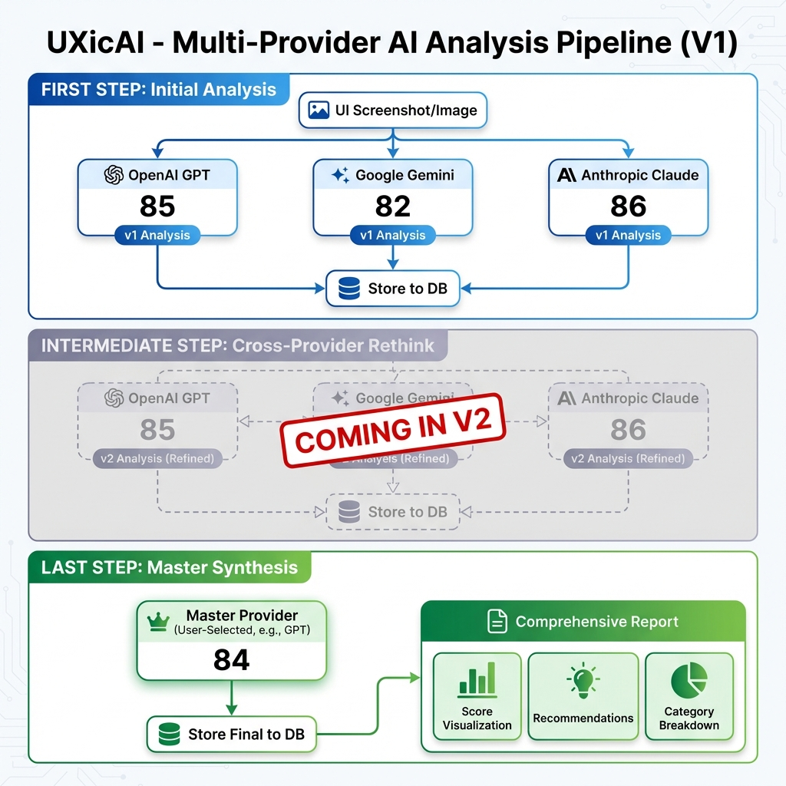

# AI Analysis Pipeline

## Overview

The UXicAI service uses a sophisticated multi-step multi-provider AI pipeline to deliver comprehensive UI/UX analysis. This approach combines insights from multiple AI vision models to reduce bias and increase accuracy.

## Pipeline Architecture



## Three-Step Process

### First Step: Initial Analysis
**Purpose:** Independent evaluation from each AI provider

- User uploads a screenshot or captures their screen
- Image is sent to all selected AI providers in parallel:
  - **OpenAI GPT** - Best for detailed observations
  - **Google Gemini Pro** - Great for visual patterns
  - **Anthropic Claude** - Excellent for accessibility
- Each provider analyzes across 8 categories:
  - Color & Contrast
  - Typography
  - Layout Composition
  - Navigation
  - Accessibility
  - Visual Hierarchy
  - Whitespace
  - Consistency
- All v1 results are stored in the database

**Output:** Individual analysis from each provider with category scores and recommendations

---

### Intermediate Step: Cross-Provider Rethink
**Status:** Planned for Version 2

This intermediate refinement step will be implemented in a future version of the application.

---

### Last Step: Master Synthesis
**Purpose:** Final authoritative assessment

- User's chosen "Master Provider" synthesizes all v2 results
- Resolves disagreements by weighing arguments
- Identifies high-agreement areas (likely accurate)
- Highlights unresolved disagreements (may need human judgment)
- Provides weighted final scores and prioritized recommendations
- Final result is stored in the database

**Output:** Comprehensive final report with overall score, category breakdown, and actionable recommendations

---

## Key Benefits

### Multi-Provider Intelligence
- **Reduces Bias**: No single AI model's limitations dominate
- **Increases Accuracy**: Cross-validation catches errors
- **Broader Perspective**: Different models excel at different aspects

### Transparent Process
- All intermediate results (v1 and v2) are stored
- Users can review each provider's perspective
- Full audit trail of the analysis process

### Customizable
- Users select which providers to include
- Users choose their trusted "Master Provider" for final synthesis
- Prompt templates are versioned and can be A/B tested

---

## Technical Implementation

### Providers
- [OpenAIProvider](file:///.//src/lib/ai/providers/openai.ts) - GPT implementation
- [GeminiProvider](file:///.//src/lib/ai/providers/gemini.ts) - Gemini implementation
- [ClaudeProvider](file:///.//src/lib/ai/providers/claude.ts) - Claude implementation

### Orchestrator
The [AnalysisOrchestrator](file:///.//src/lib/ai/orchestrator.ts) coordinates the entire pipeline:
```typescript
const orchestrator = new AnalysisOrchestrator({
  openai: process.env.OPENAI_API_KEY,
  gemini: process.env.GEMINI_API_KEY,
  claude: process.env.ANTHROPIC_API_KEY,
  copilot: process.env.GITHUB_COPILOT_API_KEY // experimental
});

const results = await orchestrator.runPipeline(
  imageBase64,
  {
    providers: ['openai', 'gemini', 'claude'],
    masterProvider: 'openai'
  }
);
```

### Database Schema
All analysis results are stored with full traceability:
- `analyses` - Main analysis record
- `analysis_responses` - Individual provider responses (v1, v2, v3)
- `usage_tracking` - Token usage and costs

---

## Future Enhancements

### Planned (Advanced Quality Improvements)

#### 1. Multi-Sampling Strategy
**Purpose**: Leverage LLM non-determinism for ensemble analysis

Instead of calling each provider once per step, allow multiple calls to the same model:
- **User Configuration**: Let users specify how many times to sample each provider (e.g., "Call GPT 3 times")
- **Prompt Variation**: Optionally vary the prompt slightly between samples (temperature, phrasing)
- **Ensemble Aggregation**: Combine multiple responses from the same provider
  - Average scores across samples
  - Identify consistent observations (high confidence)
  - Flag divergent observations (ambiguous areas)
  
**Example Configuration**:
```typescript
{
  providers: [
    { name: 'openai', samples: 3 },
    { name: 'gemini', samples: 2 },
    { name: 'claude', samples: 1 }
  ],
  masterProvider: 'openai'
}
```

**Benefits**:
- Reduces impact of random variance in LLM outputs
- Higher confidence in repeated observations
- Can identify areas where the model is "uncertain"

---

#### 2. Iterative Refinement Loops
**Purpose**: Deep deliberation through multiple rethink cycles

Allow the rethink step (Step 2) to repeat multiple times:
- **Iteration 1**: Initial rethink (current implementation)
- **Iteration 2+**: Each provider refines based on all previous iterations
- **Convergence Detection**: Stop when scores stabilize across iterations
- **Configurable Depth**: User sets max iterations (e.g., `iterations: 3`)

**Process Flow**:
```
Step 1: Initial → v1 results
Step 2a: Rethink Round 1 → v2 results
Step 2b: Rethink Round 2 → v3 results (based on v1 + v2)
Step 2c: Rethink Round 3 → v4 results (based on v1 + v2 + v3)
Step 3: Synthesis (using v1, v2, v3, v4)
```

**Benefits**:
- Deeper collaborative reasoning
- Allows providers to build on each other's refined insights
- Can reveal subtle issues missed in single-pass review
- Useful for complex UIs requiring nuanced analysis

**Database Impact**:
- Store all iteration results: `v2_rethink_r1`, `v2_rethink_r2`, etc.
- Track convergence metrics (score delta between iterations)

---

### Other Enhancements

- **Streaming Updates**: Real-time progress via Server-Sent Events
- **Custom Prompts**: User-defined evaluation criteria
- **Historical Comparison**: Track design improvements over time
- **Team Collaboration**: Share analyses with team members
- **Cost Optimization**: Intelligent provider selection based on budget
- **Confidence Scoring**: Statistical confidence intervals for scores
