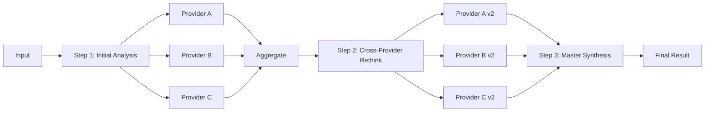

# AnalyzicAI Platform Architecture

**Last Updated:** 2026-02-12

## Platform Overview

**AnalyzicAI** is a multi-application AI analysis platform built as a pnpm monorepo. It provides specialized analysis tools powered by multiple AI vision models (OpenAI, Gemini, Anthropic).

### Applications

| Application    | Purpose                                      | Domain                                                                |
| -------------- | -------------------------------------------- | --------------------------------------------------------------------- |
| **AnalyzicAI** | AnalyzicAI landing page                      | Descriptive website for the iterative multi-agent rethinking approach |
| **UXicAI**     | UI/UX analysis for websites and applications | Design & User Experience                                              |
| **SolidicAI**  | Smart contract security analysis             | Blockchain & Security                                                 |

Both applications share common infrastructure through workspace packages.

---

## Monorepo Structure

```
app.UXicAI.com/
├── apps/
│   ├── analyzicai/         # AnalyzicAI landing page
│   │
│   ├── uxicai/         # UI/UX analysis application
│   │
│   └── solidicai/      # Smart contract analysis application
│
├── packages/
│   ├── ai-core/        # Shared AI provider abstractions
│   │
│   └── ui-library/     # Shared UI components
│
├── supabase/
│
└── pnpm-workspace.yaml
```

---

## Shared Packages

### `@web3web4/ai-core`

**Purpose:** Centralized AI provider infrastructure

**Key Components:**

- **Base Provider**: Abstract interface all providers implement
- **Orchestrator**: 3-step multi-provider analysis pipeline
- **Model Tiers**: Database-driven model configuration system
- **Providers**: OpenAI, Gemini, Anthropic implementations
- **Domain Logic**: Analysis-specific prompts and schemas
  - UX Analysis (color, typography, layout, accessibility, etc.)
  - Contract Analysis (security, gas optimization, best practices)

**Benefits:**

- Single codebase for AI logic across all apps
- Consistent provider behavior
- Easy to add new AI providers or analysis domains

### `@web3web4/ui-library`

**Purpose:** Shared React components

**Key Components:**

- `Logo` - Platform branding
- `DashboardHeader` - Navigation with user menu
- `AnalysisCard` - Analysis result cards
- `EmptyState` - Empty state illustrations
- `MultiSelectButtonGroup` - Multi-select UI pattern
- `BusinessSectorSelector` - Business sector tags

**Benefits:**

- Consistent design system across apps
- Reusable UI patterns
- Single source of truth for branding

---

## AI Analysis Pipeline

### 3-Step Orchestration

Both applications use the same AI orchestration pipeline:



**How it Works:**

1. **Initial Analysis**: Each selected AI provider analyzes independently
2. **Cross-Provider Rethink**: Providers see each other's results and reconsider
3. **Master Synthesis**: User's chosen "master" provider creates final result

**Stored Data:**

- All v1 responses (initial analysis)
- All v2 responses (after rethink)
- Final synthesis result
- Enables transparency and provider comparison

---

## Database-Driven Model Configuration

**Added:** 2026-02-12

### Problem Solved

Previously, model names were hardcoded in `.env` files, creating duplication:

- UI showed one model name (hardcoded in TypeScript)
- Runtime used another model name (from `.env`)
- Required updating multiple places when models changed

### Current Solution

Model names are stored in Supabase `model_configurations` table:

```sql
CREATE TABLE model_configurations (
  id UUID PRIMARY KEY DEFAULT gen_random_uuid(),
  provider TEXT NOT NULL,  -- 'openai' | 'gemini' | 'anthropic'
  tier TEXT NOT NULL,      -- 'tier1' | 'tier2' | 'tier3'
  model_name TEXT NOT NULL,
  is_active BOOLEAN DEFAULT true,
  created_at TIMESTAMPTZ DEFAULT NOW(),
  UNIQUE(provider, tier)
);
```

**Model Tier System:**

- **Tier 1**: Cheapest (e.g., `gpt-5-nano`, `gemini-1.5-flash-8b`)
- **Tier 2**: Balanced (e.g., `gpt-5-mini`, `gemini-2.5-flash`)
- **Tier 3**: Premium (e.g., `gpt-5.2-pro`, `gemini-3-pro-preview`)

**Benefits:**

- Single source of truth for model names
- UI and runtime always in sync
- Easy model updates without code deployment
- Per-provider tier selection (users can choose tier1 for OpenAI, tier3 for Anthropic, etc.)

---

## Authentication & Storage

### Supabase Integration

Both applications use Supabase for:

- **Authentication**: Email + social OAuth (GitHub, Google, etc.)
- **Database**: PostgreSQL with Row-Level Security (RLS)
- **Storage**: Image and file uploads
- **Real-time**: (Future) Live collaboration features

### Row-Level Security

All database tables enforce user isolation:

```sql
CREATE POLICY "Users can view own analyses"
  ON analyses FOR SELECT
  USING (auth.uid() = user_id);
```

Users can only access their own data.

---

## Database Schema

### Core Tables

**`analyses`**

- Stores analysis sessions
- Tracks status: pending → completed/failed/partial
- Multi-image support via `image_paths TEXT[]`
- Provider configuration: which models were used

**`analysis_responses`**

- Stores all AI responses (v1, v2, final)
- Enables provider comparison
- Tracks tokens used and latency

**`model_configurations`**

- Dynamic AI model configuration
- 9 entries (3 providers × 3 tiers)

---

## Tech Stack

| Layer          | Technology                           |
| -------------- | ------------------------------------ |
| **Framework**  | Next.js 16 (App Router)              |
| **Language**   | TypeScript                           |
| **Styling**    | Tailwind CSS                         |
| **Monorepo**   | pnpm workspaces                      |
| **Backend**    | Supabase (Auth, PostgreSQL, Storage) |
| **AI**         | OpenAI, Gemini, Anthropic APIs       |
| **Validation** | Zod schemas                          |
| **Charts**     | Recharts                             |

---

## Development Workflow

### Running Apps

```bash
# Run UXicAI
pnpm --filter uxicai dev

# Run SolidicAI
pnpm --filter solidicai dev

# Run both concurrently
pnpm dev:all
```

### Building

```bash
# Build specific app
pnpm --filter uxicai build

# Build all packages
pnpm build
```

### Package Dependencies

Both apps depend on shared packages:

```json
{
  "dependencies": {
    "@web3web4/ai-core": "workspace:*",
    "@web3web4/ui-library": "workspace:*"
  }
}
```

---

## Application-Specific Features

### UXicAI

**Analysis Categories:**

- Color Contrast
- Typography
- Layout & Composition
- Navigation
- Accessibility
- Visual Hierarchy
- Whitespace
- Consistency

**Input Methods:**

- Multi-image upload (up to 10 images)
- Screen capture (WebRTC)
- Website context (target audience, business sector)

### SolidicAI

**Analysis Categories:**

- Security vulnerabilities
- Gas optimization
- Best practices
- Code quality
- Access control
- Reentrancy protection

**Input Methods:**

- Solidity code paste
- File upload (.sol)
- Code truncation control for large contracts

---

## Future Architecture

**Tentatively Planned:**

- [ ] Additional analysis domains (mobile apps, API design)
- [ ] Real-time collaboration features
- [ ] Team workspaces with shared analyses
- [ ] Custom prompt templates per user
- [ ] Historical comparison (compare two analyses)
