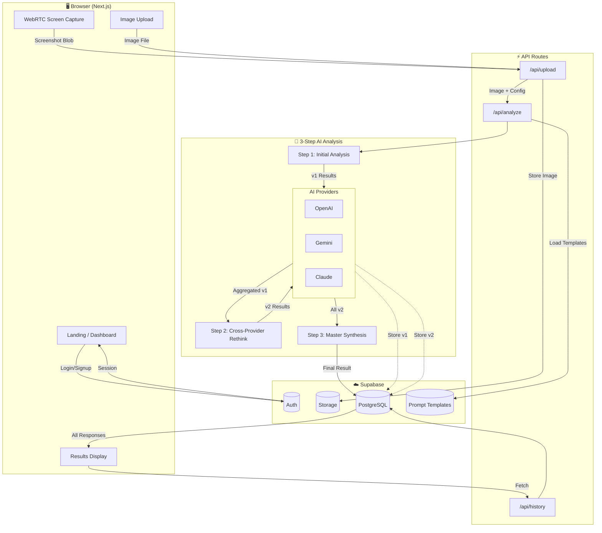
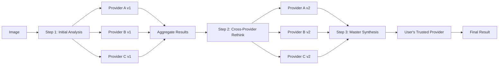

# UXicAI - AI-Powered UI/UX Analysis Platform

An intelligent utility application that analyzes the UI/UX of applications and websites by processing screenshots or live web pages using multiple AI Vision models.

## User Review Required

> [!IMPORTANT]
> **AI Provider API Keys**: You'll need API keys for at least one AI vision provider (OpenAI GPT Thinking/Pro, Google Gemini Pro Vision, or Anthropic Claude Sonnet/Opus). The multi-provider combination feature requires at least two providers.

> [!IMPORTANT]
> **Supabase Project**: A Supabase project is required. You can use local development via Docker or a cloud project at [supabase.com](https://supabase.com).

> [!NOTE]
> **WebRTC vs Puppeteer**: This plan uses **client-side WebRTC** for screenshot capture (screen sharing API). This approach is more privacy-friendly and doesn't require server-side browser instances, but requires user permission. For URL-based capture where the user doesn't have the page open, a fallback server-side solution may be needed.

---

## Tech Stack

| Layer | Technology |
|-------|------------|
| **Framework** | next.js 16 (App Router) |
| **Language** | TypeScript |
| **Styling** | Tailwind CSS |
| **Auth/Database/Storage** | Supabase |
| **Social Auth** | GitHub, Figma, Notion, Google, Apple, Azure (Microsoft) |
| **Screenshot Capture** | WebRTC (MediaDevices.getDisplayMedia) |
| **AI Vision** | OpenAI GPT, Google Gemini, Anthropic Claude |
| **Validation** | Zod |

---

## System Architecture



**Data Flow Summary:**

| Flow | Path |
|------|------|
| **Auth** | UI → Supabase Auth (GitHub/Figma/Notion/Google/Apple/Azure) → Session |
| **Capture** | WebRTC/Upload → `/api/upload` → Supabase Storage |
| **Analyze** | Image → Step 1 → **DB** → Step 2 → **DB** → Step 3 → **DB** |
| **History** | Dashboard → `/api/history` → All responses (v1, v2, final) |

---

## Implementation Phases

### Phase 1: Foundation ✅
**Goal:** Working scaffold with auth

- [x] Initialize Next.js 16 + Tailwind + TypeScript
- [x] Set up Supabase (local Docker or cloud)
- [x] Create database migrations
- [x] Implement Supabase Auth with middleware
- [x] Basic landing page + login/signup pages

**Deliverable:** Can sign up, log in, see empty dashboard

---

### Phase 2: Capture & Upload ✅
**Goal:** Get images into the system

- [x] WebRTC screen capture component
- [x] Drag-and-drop image upload component
- [x] `/api/upload` route → Supabase Storage
- [x] Dashboard analyze page with capture UI

**Deliverable:** Can capture screen or upload image, see it stored

---

### Phase 3: Single AI Provider ✅
**Goal:** End-to-end analysis with ONE provider

- [x] AI types & base provider interface
- [x] OpenAI GPT provider implementation
- [x] Prompt templates (initial analysis only)
- [x] `/api/analyze` route (single provider)
- [x] Basic results display

**Deliverable:** Upload image → Get OpenAI analysis → See results

---

### Phase 4: Multi-Provider Pipeline ✅
**Goal:** Full multi-step analysis

- [x] Add Gemini and Claude providers
- [x] Build orchestrator (multi-step pipeline)
- [x] Wire orchestrator into `/api/analyze` route
- [x] Store all responses (v1, v2, final) in DB
- [x] Provider selection UI
- [x] Master provider selection

**Deliverable:** Full pipeline working with multiple providers

---

### Phase 5: History & Polish 🚧
**Goal:** Complete MVP

- [x] `/api/history` route
- [x] History page with filtering
- [x] Rate limiting middleware
- [x] Usage tracking
- [x] Error handling & loading states
- [ ] Testing and validation
- [ ] Prompt optimization
- [ ] Responsive design polish

**Deliverable:** Complete, usable MVP

---

## Proposed Changes

### Core Structure

#### [NEW] [Project Initialization](file:///./)

Initialize next.js 16 with TypeScript and Tailwind:
```bash
npx -y create-next-app@latest ./ --typescript --tailwind --app --src-dir --eslint
```

---

### Configuration Files

#### [NEW] [.env.local](file:///.//.env.local)

```env
# Supabase
NEXT_PUBLIC_SUPABASE_URL=http://127.0.0.1:54321
NEXT_PUBLIC_SUPABASE_ANON_KEY=your-anon-key
SUPABASE_SERVICE_ROLE_KEY=your-service-key

# AI Providers
OPENAI_API_KEY=sk-...
GEMINI_API_KEY=...
ANTHROPIC_API_KEY=sk-ant-...

# Provider for synthesis (second-pass combination)
SYNTHESIS_PROVIDER=openai
```

---

### Supabase Integration

#### [NEW] [supabase/migrations/001_analyses.sql](file:///.//supabase/migrations/001_analyses.sql)

```sql
-- Main analysis session
CREATE TABLE analyses (
  id UUID PRIMARY KEY DEFAULT gen_random_uuid(),
  user_id UUID REFERENCES auth.users(id) ON DELETE CASCADE NOT NULL,
  source_type TEXT NOT NULL CHECK (source_type IN ('upload', 'screen_capture', 'url')),
  source_url TEXT,
  image_path TEXT NOT NULL,
  providers_used TEXT[] NOT NULL,
  master_provider TEXT NOT NULL,
  status TEXT DEFAULT 'pending' CHECK (status IN ('pending', 'step1', 'step2', 'step3', 'completed', 'failed')),
  final_score INTEGER,
  created_at TIMESTAMPTZ DEFAULT NOW(),
  completed_at TIMESTAMPTZ
);

-- Every AI response stored separately
CREATE TABLE analysis_responses (
  id UUID PRIMARY KEY DEFAULT gen_random_uuid(),
  analysis_id UUID REFERENCES analyses(id) ON DELETE CASCADE NOT NULL,
  provider TEXT NOT NULL,
  step TEXT NOT NULL CHECK (step IN ('v1_initial', 'v2_rethink', 'v3_synthesis')),
  result JSONB NOT NULL,
  score INTEGER,
  tokens_used INTEGER DEFAULT 0,
  latency_ms INTEGER,
  created_at TIMESTAMPTZ DEFAULT NOW()
);

-- Usage tracking table
CREATE TABLE usage_tracking (
  id UUID PRIMARY KEY DEFAULT gen_random_uuid(),
  user_id UUID REFERENCES auth.users(id) ON DELETE CASCADE NOT NULL,
  analysis_id UUID REFERENCES analyses(id) ON DELETE SET NULL,
  provider TEXT NOT NULL,
  tokens_used INTEGER DEFAULT 0,
  created_at TIMESTAMPTZ DEFAULT NOW()
);

-- Indexes
CREATE INDEX idx_responses_analysis ON analysis_responses(analysis_id);
CREATE INDEX idx_responses_step ON analysis_responses(analysis_id, step);
CREATE INDEX idx_analyses_user_id ON analyses(user_id);
CREATE INDEX idx_analyses_created_at ON analyses(created_at DESC);
CREATE INDEX idx_usage_user_date ON usage_tracking(user_id, created_at);

-- RLS for analyses
ALTER TABLE analyses ENABLE ROW LEVEL SECURITY;
CREATE POLICY "Users can view own analyses" ON analyses FOR SELECT USING (auth.uid() = user_id);
CREATE POLICY "Users can insert own analyses" ON analyses FOR INSERT WITH CHECK (auth.uid() = user_id);
CREATE POLICY "Users can delete own analyses" ON analyses FOR DELETE USING (auth.uid() = user_id);

-- RLS for analysis_responses (via parent analysis)
ALTER TABLE analysis_responses ENABLE ROW LEVEL SECURITY;
CREATE POLICY "Users can view own responses" ON analysis_responses FOR SELECT 
  USING (EXISTS (SELECT 1 FROM analyses WHERE analyses.id = analysis_id AND analyses.user_id = auth.uid()));

-- RLS for usage_tracking
ALTER TABLE usage_tracking ENABLE ROW LEVEL SECURITY;
CREATE POLICY "Users can view own usage" ON usage_tracking FOR SELECT USING (auth.uid() = user_id);
```

#### [NEW] [src/lib/supabase/client.ts](file:///.//src/lib/supabase/client.ts)

Browser client for Supabase.

#### [NEW] [src/lib/supabase/server.ts](file:///.//src/lib/supabase/server.ts)

Server-side Supabase client with service role.

#### [NEW] [src/lib/rate-limit.ts](file:///.//src/lib/rate-limit.ts)

Rate limiting utility:
```typescript
const DAILY_LIMIT = 10; // analyses per day for free tier

export async function checkRateLimit(userId: string): Promise<{
  allowed: boolean;
  remaining: number;
  resetAt: Date;
}>
```

#### [NEW] [src/middleware.ts](file:///.//src/middleware.ts)

Supabase Auth middleware for session refresh.

---

### AI Provider Abstraction

#### [NEW] [src/lib/ai/types.ts](file:///.//src/lib/ai/types.ts)

```typescript
export interface CategoryScore {
  score: number; // 0-100
  observations: string[];
}

export interface Recommendation {
  severity: 'low' | 'medium' | 'high' | 'critical';
  category: string;
  title: string;
  description: string;
}

export interface AnalysisResult {
  provider: string;
  overallScore: number;
  categories: {
    colorContrast: CategoryScore;
    typography: CategoryScore;
    layoutComposition: CategoryScore;
    navigation: CategoryScore;
    accessibility: CategoryScore;
    visualHierarchy: CategoryScore;
    whitespace: CategoryScore;
    consistency: CategoryScore;
  };
  recommendations: Recommendation[];
  summary: string;
}

export interface SynthesizedResult {
  overallScore: number;
  categories: AnalysisResult['categories'];
  recommendations: Recommendation[];
  summary: string;
  providerAgreement: {
    category: string;
    agreement: 'high' | 'medium' | 'low';
  }[];
}
```

#### [NEW] [src/lib/ai/base-provider.ts](file:///.//src/lib/ai/base-provider.ts)

Abstract provider interface.

#### [NEW] [src/lib/ai/providers/openai.ts](file:///.//src/lib/ai/providers/openai.ts)

OpenAI GPT implementation.

#### [NEW] [src/lib/ai/providers/gemini.ts](file:///.//src/lib/ai/providers/gemini.ts)

Google Gemini Pro Vision implementation.

#### [NEW] [src/lib/ai/providers/anthropic.ts](file:///.//src/lib/ai/providers/anthropic.ts)

Anthropic Claude implementation.

#### [NEW] [src/lib/ai/orchestrator.ts](file:///.//src/lib/ai/orchestrator.ts)

**3-Step Analysis Pipeline:**



```typescript
export interface AnalysisConfig {
  providers: ('openai' | 'gemini' | 'anthropic')[];
  masterProvider: 'openai' | 'gemini' | 'anthropic';
}

export async function runAnalysisPipeline(
  config: AnalysisConfig,
  imagesBase64?: string[],
): Promise<FinalAnalysisResult> {
  // Step 1: Initial analysis from each provider
  const v1Results = await Promise.all(
    config.providers.map(p => analyze(p, imagesBase64, 'initial'))
  );
  
  // Step 2: Each provider rethinks with others' results
  const v2Results = await Promise.all(
    config.providers.map(p => 
      analyze(p, imagesBase64, 'rethink', aggregateOthersResults(p, v1Results))
    )
  );
  
  // Step 3: Master provider synthesizes final result
  return synthesize(config.masterProvider, imagesBase64, v2Results);
}
```

---

### Prompt Engineering Architecture

> [!IMPORTANT]
> **Design Decision**: Prompts are stored as versioned templates in the database or file system, not hardcoded. This enables A/B testing, iteration, and user customization without code deployment.

#### [NEW] [src/lib/ai/prompts/](file:///.//src/lib/ai/prompts/)

**Prompt Template Structure:**
```typescript
// src/lib/ai/prompts/types.ts
export interface PromptTemplate {
  id: string;
  version: string;
  systemPrompt: string;       // Role & constraints
  userPromptTemplate: string; // With {{variables}}
  outputSchema: ZodSchema;    // Expected JSON structure
}

// Template variable injection
export function buildPrompt(
  template: PromptTemplate,
  context: Record<string, unknown>
): string;
```

**Step-Specific Prompts:**

| Step | Prompt Focus |
|------|-------------|
| **Initial** | Image-only analysis with UX heuristics checklist |
| **Rethink** | Image + other providers' scores/observations to reconsider |
| **Synthesis** | All v2 results → resolve disagreements, weighted final scores |

**RAG-Style Context Injection Patterns:**

1. **Static Context**: UX guidelines, WCAG standards, Nielsen heuristics embedded in system prompt
2. **Dynamic Context**: Previous analyses of same domain/app type for comparison
3. **User Context**: Custom evaluation criteria, brand guidelines (future feature)

```typescript
// Example: Rethink prompt with injected context
const rethinkPrompt = `
## Your Previous Analysis
${JSON.stringify(myV1Result)}

## Other AI Perspectives
${otherResults.map(r => `### ${r.provider}\n${JSON.stringify(r)}`).join('\n')}

## Your Task
Reconsider your analysis. Where do you agree/disagree with others? 
Provide your revised assessment with updated scores and reasoning.
`;
```

#### [NEW] [supabase/migrations/002_prompts.sql](file:///.//supabase/migrations/002_prompts.sql)

```sql
-- Prompt template versioning
CREATE TABLE prompt_templates (
  id UUID PRIMARY KEY DEFAULT gen_random_uuid(),
  name TEXT NOT NULL,
  step TEXT NOT NULL CHECK (step IN ('initial', 'rethink', 'synthesis')),
  version INTEGER NOT NULL DEFAULT 1,
  system_prompt TEXT NOT NULL,
  user_prompt_template TEXT NOT NULL,
  is_active BOOLEAN DEFAULT true,
  created_at TIMESTAMPTZ DEFAULT NOW(),
  UNIQUE(name, version)
);
```

---

### WebRTC Screen Capture

#### [NEW] [src/lib/capture/screen-capture.ts](file:///.//src/lib/capture/screen-capture.ts)

```typescript
export async function captureScreen(): Promise<Blob> {
  const stream = await navigator.mediaDevices.getDisplayMedia({
    video: { displaySurface: 'browser' },
    preferCurrentTab: true
  });
  
  const video = document.createElement('video');
  video.srcObject = stream;
  await video.play();
  
  const canvas = document.createElement('canvas');
  canvas.width = video.videoWidth;
  canvas.height = video.videoHeight;
  const ctx = canvas.getContext('2d')!;
  ctx.drawImage(video, 0, 0);
  
  // Stop all tracks
  stream.getTracks().forEach(track => track.stop());
  
  return new Promise((resolve) => {
    canvas.toBlob((blob) => resolve(blob!), 'image/png');
  });
}
```

---

### API Routes

#### [NEW] [src/app/api/upload/route.ts](file:///.//src/app/api/upload/route.ts)

Handles image upload to Supabase Storage.

#### [NEW] [src/app/api/analyze/route.ts](file:///.//src/app/api/analyze/route.ts)

Orchestrates 3-step multi-provider analysis:
1. **Step 1**: Call each selected provider for initial analysis (parallel)
2. **Step 2**: Send aggregated results back to each provider for rethink (parallel)
3. **Step 3**: Send all v2 results to user's master provider for final synthesis
4. Store results in database with usage tracking

#### [NEW] [src/app/api/history/route.ts](file:///.//src/app/api/history/route.ts)

Retrieves user's analysis history.

---

### Frontend Pages

#### [NEW] [src/app/page.tsx](file:///.//src/app/page.tsx)

Landing page with premium design featuring:
- Hero section with value proposition
- Feature highlights
- CTA to get started

#### [NEW] [src/app/(auth)/login/page.tsx](file:///.//src/app/(auth)/login/page.tsx)

Login page with email and social auth (GitHub, Figma, Notion, Google, Apple, Azure).

#### [NEW] [src/app/(auth)/signup/page.tsx](file:///.//src/app/(auth)/signup/page.tsx)

Signup page.

#### [NEW] [src/app/(auth)/callback/route.ts](file:///.//src/app/(auth)/callback/route.ts)

OAuth callback handler.

#### [NEW] [src/app/dashboard/page.tsx](file:///.//src/app/dashboard/page.tsx)

Main dashboard with:
- New analysis CTA
- Recent analyses
- Quick actions

#### [NEW] [src/app/dashboard/analyze/page.tsx](file:///.//src/app/dashboard/analyze/page.tsx)

Analysis interface with:
- Image upload zone
- Screen capture button (WebRTC)
- Provider selection
- Analysis progress

#### [NEW] [src/app/dashboard/results/[id]/page.tsx](file:///.//src/app/dashboard/results/[id]/page.tsx)

Results display with:
- Overall score visualization
- Category breakdowns
- Provider comparison (if multiple)
- Recommendations list

#### [NEW] [src/app/dashboard/history/page.tsx](file:///.//src/app/dashboard/history/page.tsx)

Analysis history with filtering and search.

---

### UI Components

#### [NEW] [src/components/ui/](file:///.//src/components/ui/)

Core UI components:
- `Button`, `Card`, `Input`, `Select`
- `ScoreGauge` - Circular score visualization
- `CategoryBar` - Horizontal category score bar
- `RecommendationCard` - Severity-coded recommendation display
- `ProviderBadge` - AI provider indicator

#### [NEW] [src/components/capture/ScreenCapture.tsx](file:///.//src/components/capture/ScreenCapture.tsx)

WebRTC screen capture component with permission handling.

#### [NEW] [src/components/capture/ImageUpload.tsx](file:///.//src/components/capture/ImageUpload.tsx)

Drag-and-drop image upload with preview.

---

## Verification Plan

### Automated Tests

Since this is a new project, we'll set up the testing infrastructure during implementation.

**Unit Tests** (Vitest):
```bash
pnpm run test
```
- AI provider response parsing
- Synthesizer logic
- Zod schema validation

**Integration Tests**:
- Supabase RLS policy verification
- API route authentication checks

### Manual Verification

1. **Auth Flow**:
   - Open `http://localhost:3000`
   - Click "Get Started" → redirects to login
   - Sign up with email → verify email confirmation
   - Login → redirects to dashboard

2. **Screen Capture**:
   - Navigate to `/dashboard/analyze`
   - Click "Capture Screen"
   - Grant permission in browser dialog
   - Verify screenshot appears in preview

3. **Image Upload**:
   - Drag and drop an image onto upload zone
   - Verify preview appears
   - Verify file size/type validation

4. **Analysis Flow**:
   - Upload or capture a screenshot
   - Select AI providers (OpenAI + Gemini)
   - Click "Analyze"
   - Verify loading state
   - Verify results display with scores and recommendations

5. **History**:
   - Complete an analysis
   - Navigate to `/dashboard/history`
   - Verify the analysis appears in the list
   - Click to view full results

---

## File Structure Overview

```
app.uxicai/
├── src/
│   ├── app/
│   │   ├── page.tsx                    # Landing
│   │   ├── (auth)/
│   │   │   ├── login/page.tsx
│   │   │   ├── signup/page.tsx
│   │   │   └── callback/route.ts
│   │   ├── dashboard/
│   │   │   ├── page.tsx
│   │   │   ├── analyze/page.tsx
│   │   │   ├── results/[id]/page.tsx
│   │   │   └── history/page.tsx
│   │   └── api/
│   │       ├── upload/route.ts
│   │       ├── analyze/route.ts
│   │       └── history/route.ts
│   ├── components/
│   │   ├── ui/
│   │   └── capture/
│   ├── lib/
│   │   ├── supabase/
│   │   ├── ai/
│   │   │   ├── types.ts
│   │   │   ├── base-provider.ts
│   │   │   ├── synthesizer.ts
│   │   │   └── providers/
│   │   │       ├── openai.ts
│   │   │       ├── gemini.ts
│   │   │       └── anthropic.ts
│   │   └── capture/
│   │       └── screen-capture.ts
│   └── middleware.ts
├── supabase/
│   └── migrations/
│       └── 001_analyses.sql
├── .env.local
└── package.json
```
